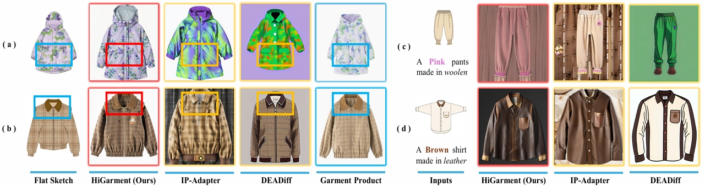
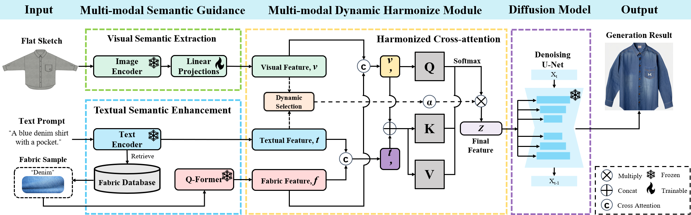
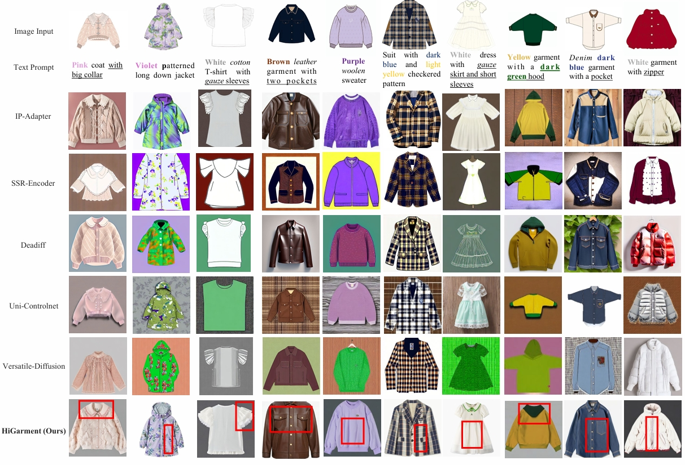
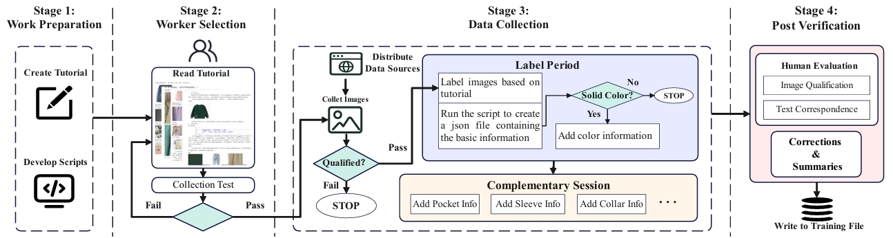

<h1 align="center">HiGarment: Cross-Modal Harmony-Based Diffusion for Flat Sketch to Real Garment</h1>

<p align="center">
  <a href="https://arxiv.org/pdf/2505.23186">
    
  </a>
</p>

---

## 📜 Introduction

We introduce **HiGarment**, a cross-modal harmony-based diffusion framework for generating photo-realistic garment images directly from flat sketches and text prompts. Unlike prior methods, HiGarment unifies structural alignment from sketches and fine-grained attribute control from language, enabling precise, production-oriented garment synthesis for the first time.

Our approach features a multi-modal semantic enhancement module to bridge fabric representation gaps between text and image, and a harmonized cross-attention mechanism to resolve conflicts between modalities during generation. With a large-scale, richly annotated MMDGarment dataset, HiGarment enables high-fidelity synthesis and flexible attribute editing throughout the design pipeline.

<p align="center">
  
</p>

Extensive experiments demonstrate that HiGarment sets a new standard for controllable and accurate garment image generation, effectively bridging creative design and real-world production needs.

**HiGarment consists of two core modules: a multi-modal semantic enhancement module(MMSE) for fabric and attribute representation, and a harmonized cross-attention(HCA) module that dynamically balances sketch and text guidance for controllable image synthesis.**

<p align="center">
  
</p>

---

## ✨ Visual Results

**HiGarment generates high-fidelity garment images with controllable attributes and precise alignment to the design sketches, enabling flexible editing and photorealistic results.**

<p align="center">
  
</p>

---

## 📦 Multi-Modal Detailed Garment Dataset

We release the **Multi-Modal Detailed Garment (MMDGarment) Dataset**, a large-scale resource specifically built for flat sketch to realistic garment generation and editing. The dataset contains high-quality garment photos, detailed close-up shots, comprehensive text annotations (covering color, fabric, and structural details), and professionally created flat sketches. All images and annotations were collected following standardized protocols, with garment experts verifying attribute accuracy and flat sketches provided by collaborating designers to ensure production-level fidelity.

<p align="center">
  
</p>

The dataset comprises three parts:
1. **Training data** — real garment images covering both full garments and close-ups, with text descriptions (download via [Google Drive](https://drive.google.com/file/d/1axAkFAAv-j_EiGfoNmHzYehgynciOr6R/view?usp=drive_link)).
2. **Fabric database** — fabric swatches and metadata (download via [Google Drive](https://drive.google.com/file/d/1PPsMyew2vSrAZLjyKD8w5QyHXoQJDdAn/view?usp=drive_link)).
3. **Flat sketch and Realistic Garment Images** — flat sketches and corresponding garment photos. Due to the copyright restriction, access to this part requires completing the application forms and legal commitment found in the [license](./license) folder.

Due to copyright restrictions, only a portion of the dataset is currently open-sourced; more data will be released progressively.

---

## :partying_face: Future Work

Our following work about garment editing has been accepted by ACM MM 2025 Dataset Track, please visit [EditGarment-project](https://yindq99.github.io/EditGarment-project/).

## 📄 Citation

If you find our work useful for your research, please consider citing our paper:

```bibtex
@article{guo2025higarment,
  title={HiGarment: Cross-modal Harmony Based Diffusion Model for Flat Sketch to Realistic Garment Image},
  author={Guo, Junyi and Zhang, Jingxuan and Wu, Fangyu and Lu, Huanda and Wang, Qiufeng and Yang, Wenmian and Lim, Eng Gee and Lu, Dongming},
  journal={arXiv preprint arXiv:2505.23186},
  year={2025}
}
